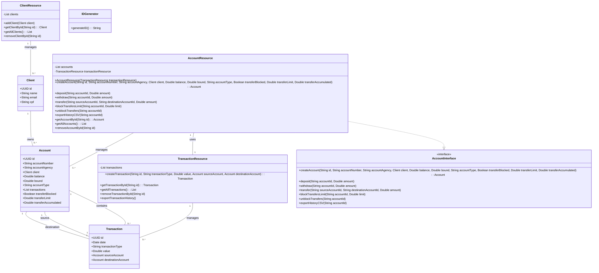
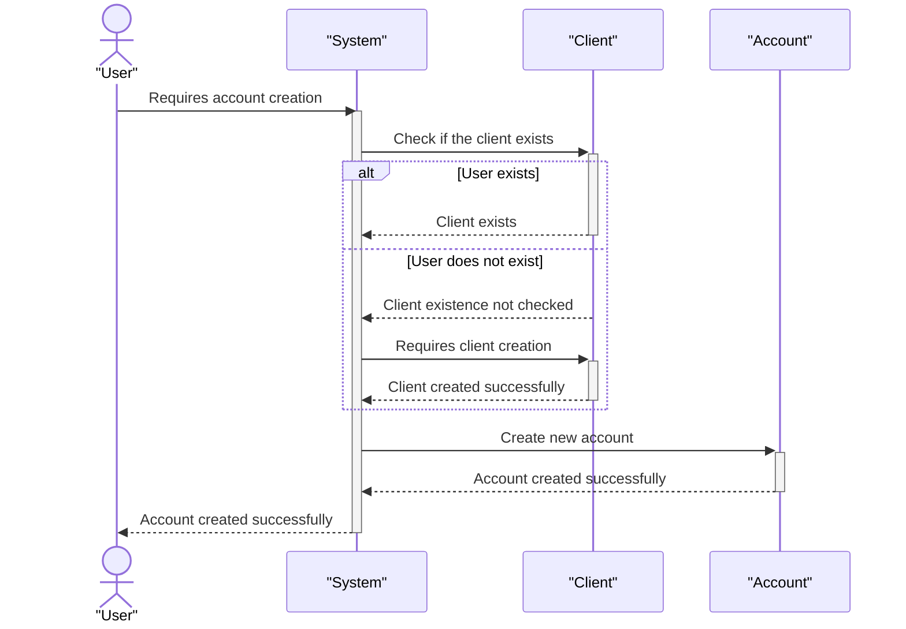
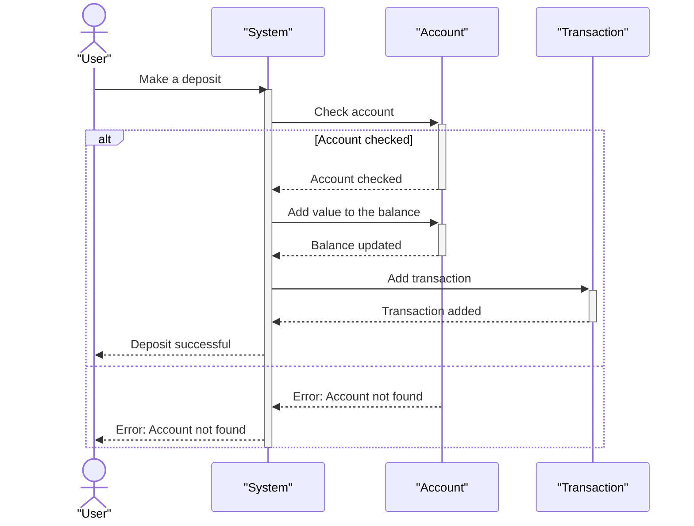
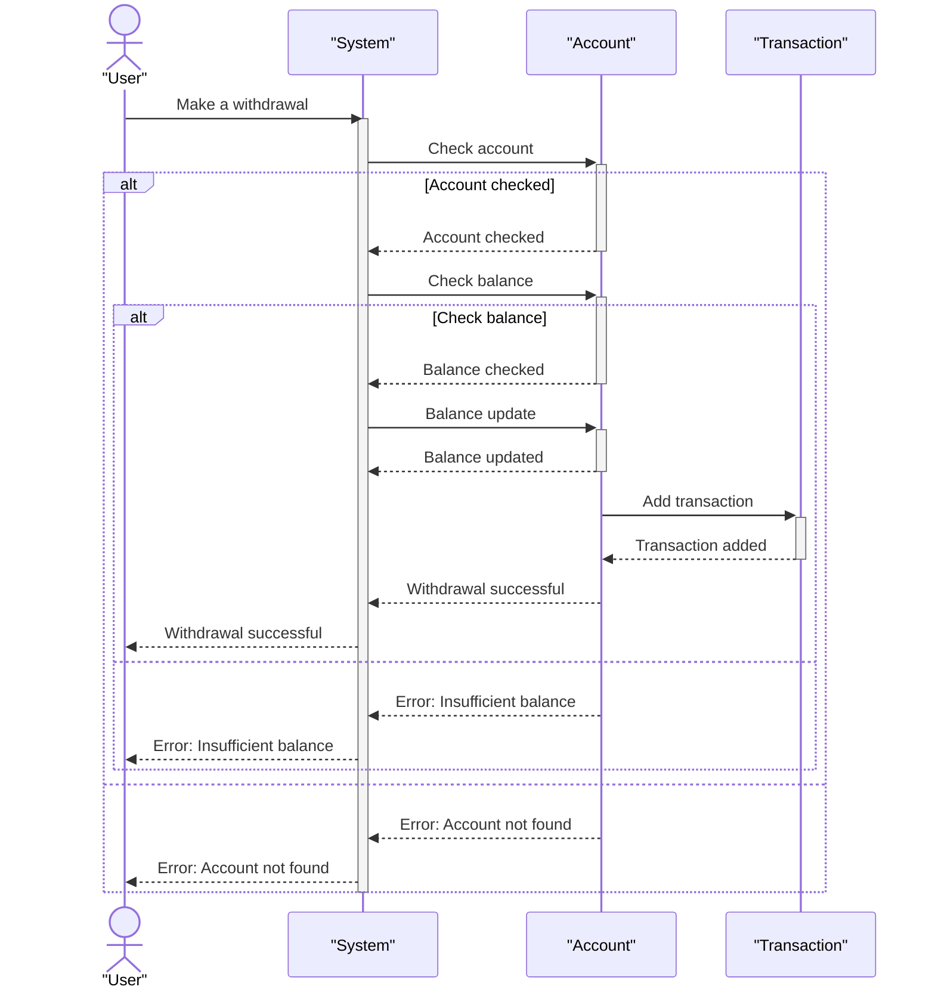
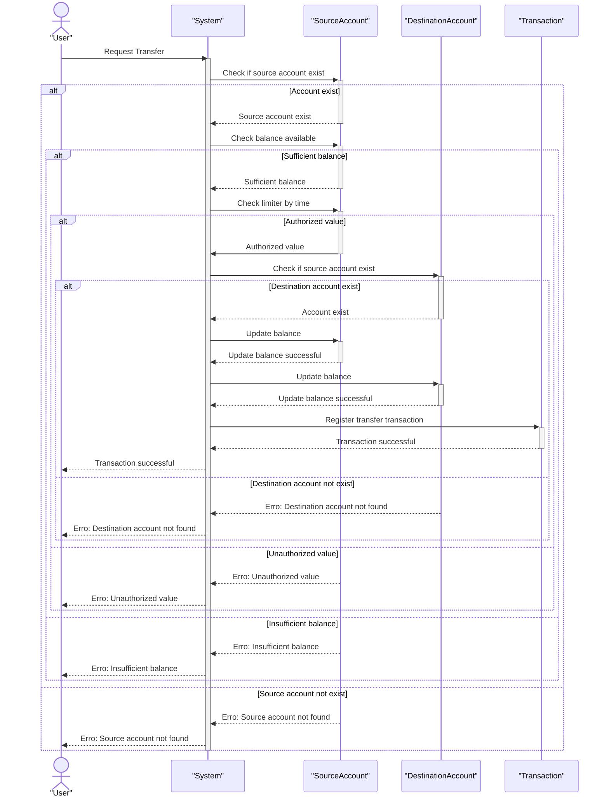
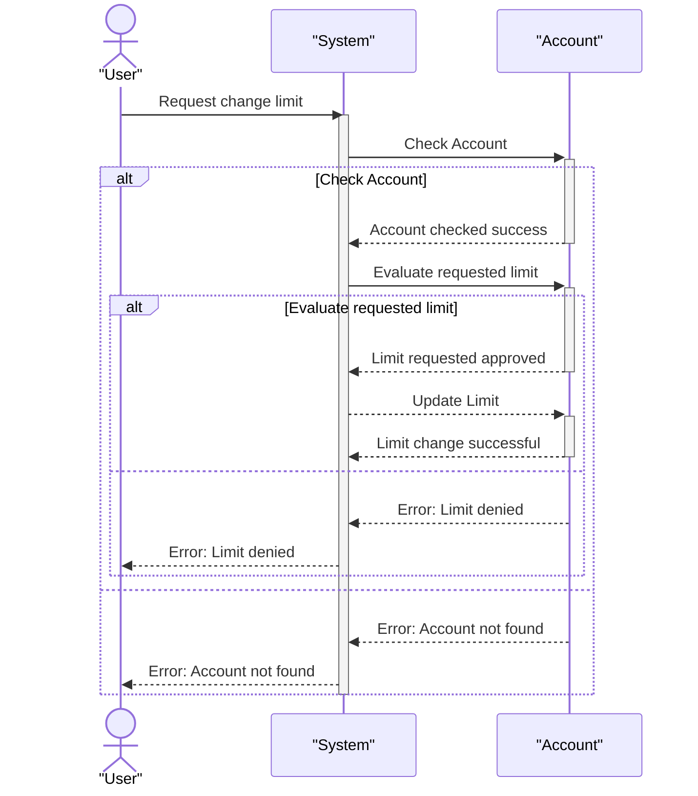
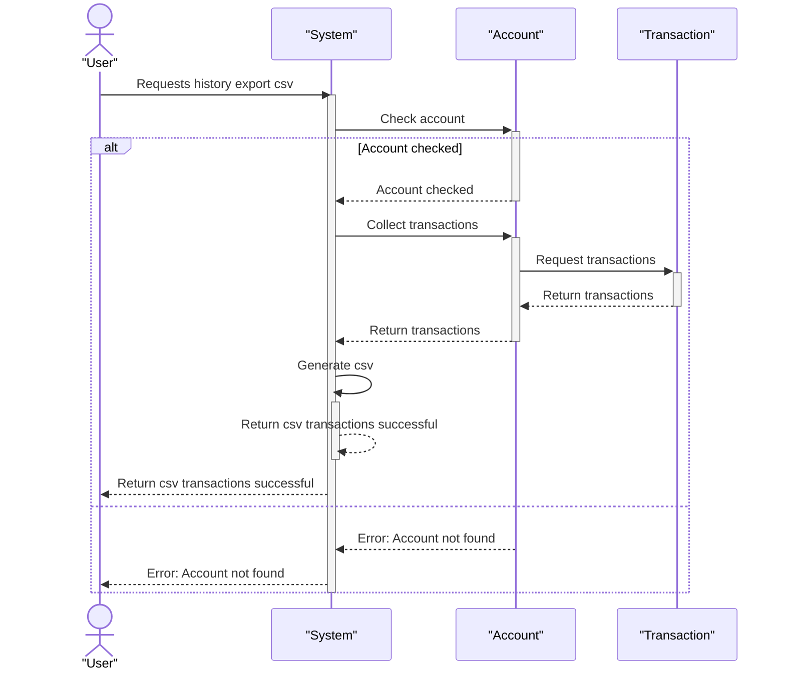

# Banking Application

## Description

This project is a banking application that allows value transfers between accounts. The system includes the following functionalities:

- **Account registration**  
  - Account number, agency number, client, balance, limit, account type  
- **Deposit**  
- **Withdrawal**  
- **Limit adjustment**  
- **Transfers**  
  - Value limitation according to the time of day  
- **Export transaction history (CSV)**  
- **Terminal menu for selecting the desired operation**  

---

## Features

### Account Registration
Allows registering a new bank account with information such as account number, agency number, client, balance, limit, and account type.

### Deposit
Allows making deposits into an existing bank account.

### Withdrawal
Allows making withdrawals from an existing bank account.

### Limit Adjustment
Allows adjusting the limit of a bank account.

### Transfers
Allows transferring values between bank accounts, with value limitation according to the time of day.

### Export Transaction History (CSV)
Allows exporting the transaction history of a bank account to a CSV file.

---

## 📂 Project Structure
```md
- BankingApplication/ 📁 *(Root Project Folder)*
  - src/ 📁 *(Source Code)*
    - application/ 📁 *(Main application)*
      - Program.java *(Main entry point)*
    - interfaces/ 📁 *(Interfaces for standardizing operations)*
      - AccountInterface.java
    - model/ 📁 *(Business Models)*
      - entities/ 📁 *(Core entities)*
        - Account.java
        - Client.java
        - Transaction.java
    - resources/ 📁 *(Business logic)*
      - AccountResource.java
      - ClientResource.java
      - TransactionResource.java
    - util/ 📁 *(Utilities)*
      - IDGenerator.java
  - data/ 📁 *(Database/CSV Storage)*
    - transactions.csv
  - README.md 📄 *(Project Documentation)*
  - .gitignore 📄 *(Ignored files for Git)*
  - LICENSE 📄 *(Project License)*
  - pom.xml 📄 *(Maven dependencies, if applicable)*
  - build.gradle 📄 *(Gradle dependencies, if applicable)*
```


## Class Diagram



## Sequence Diagram 

### Account Creation


### Deposit



### Withdrawal



### Transfer



### Limit Changed



### Transaction Historical Export (CSV)


